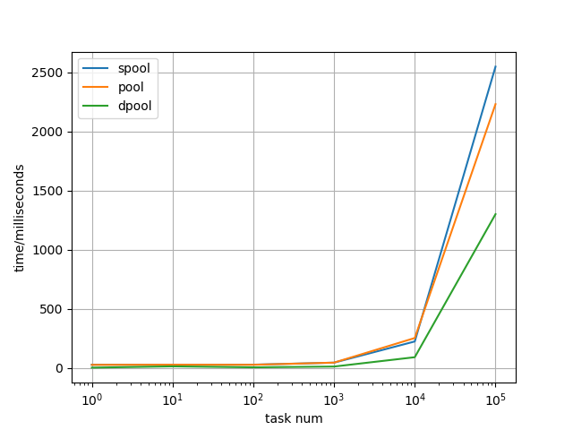

# Thread Pool Library

 


## Quick Start

```c++
#include <thread_pools.hpp>
#include <iostream>

int main()
{
    thread_pools::spool<10> pool;
    // thread_pools::pool pool(10);  // default pool
    // thread_pools::dpool pool;     // dynamic pool

    auto result = pool.enqueue([]() { return 2333; });
    std::cout << result.get() << '\n';
}
```

## Introduction

In the last 2 days, I implemented 3 kinds of thread pools:
- **thread_pools::spool<Sz>**: Static pool which holds fixed number of threads in std::array<std::thread, Sz>.
- **thread_pools::pool**: Default pool which holds fixed number of threads in std::vector<std::thread>.
- **thread_pools::dpool**: Dynamic pool which holds unfixed number of threads in std::unordered_map<thread_index, std::thread>(This is very efficient).

These kinds of pools can be qualified with different tasks according to user's specific situations.

The `spool` and `pool` are nearly the same, as their only difference is that they use different containers.

However, I myself design the growing strategy of the dynamic pool. For a `dpool(J, I, K)`:

- Dynamically adapt to the task size;
- The total threads are no more than K(Set by the user);
- The number of idle threads are no more than I(Set by the user);
- Create J threads when constructing.(Please make sure: J <= I && I < K && K > 0, or there will be a `std::logic_error`)

## Advantages

- **Header-only**: Just move the .hpp file you to ur project and run.
- **Easy to use**: Just 2 API: Constructor and enqueue.
- **Easy to learn**: I tried to use lines as few as possible to make my code concise. Not only have I added some significant comments in the code, but I've drawn a figure to show u how I designed the dynamic pool as well. Good for guys who want to learn from my code.
- **High performance**: The results of the benchmark have shown this.

## Benchmark

```shell
mkdir build && cd build
cmake .. && make -j4 && ./thread_pools
```

Copy the output python script and run it. You can see the results.
(Note that each task cost 1m. For each pool, it can at most create `psize` threads to finish `mission_sz` tasks.)


## How I Designed the Dynamic Pool


## Task and pointers

For most thread pool library, they use `std::shared_ptr` pointer to manage the `std::packaged_task<...>`. This is not efficient as it allocation more memory for 2 atomic counter. And C++ standard made old C++ versions(C++11 and former C++14)'s unique_ptr not compile when enqueuing such tasks. Hence I decided to use raw pointers with some exception code to boost the performance.

After removing the shared_ptr. The performance has been boosted by about 20%~30%.

See my comments on `spool::enqueue` in static_pool.hpp for more details.

Old shared_ptr version's performance:



## When Should You Use the Dynamic Pool

Mainly 2 situations:

- The amount of tasks are usually unknown.
- Your task running time is short(less than 3ms).

> This comes to the benefits of my dynamic pool:
> `dpool` can be very fast when each task's run time is short, as `dpool` create and destroy threads very fast.
> `dpool` can also be very fast when `task_num << max_size_of_the_pool`, as it will dynamically change the thread size.

Note that: **All the three pools will be the nearly same performance level** when your task scale is:

- Each task cost a relative long time(much longer than creating and destroying the threads).
- Your amount of task is much bigger than that of your threads.

To show this, I tested their performance where each task cost 10ms(bigger than original 1ms):


## TODOS

- Thread pool that holds fixed kind of functions. (Reduce dynamic allocation when std::function<void()> SOO cannot work)
- Lock-free thread pool.
- Comparision with other libraries.
